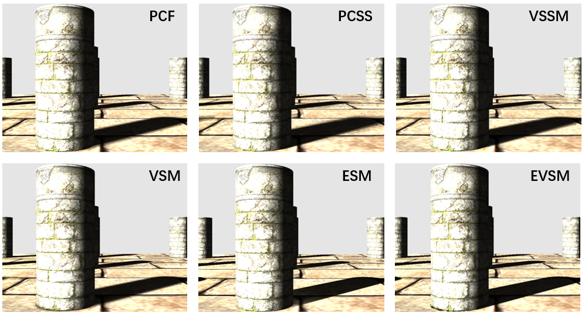
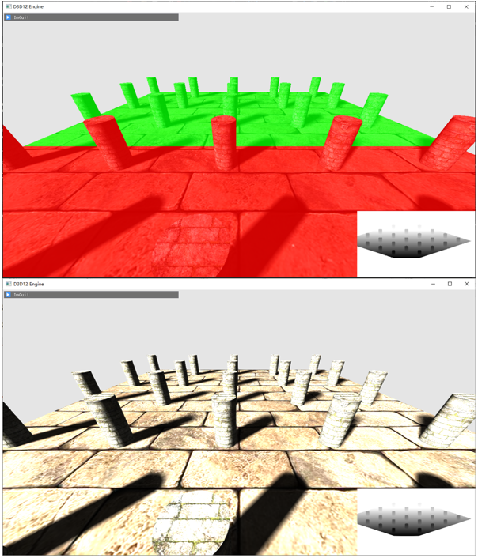
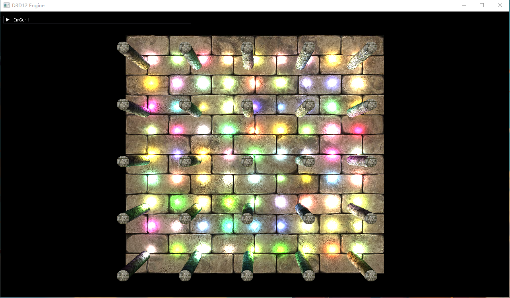
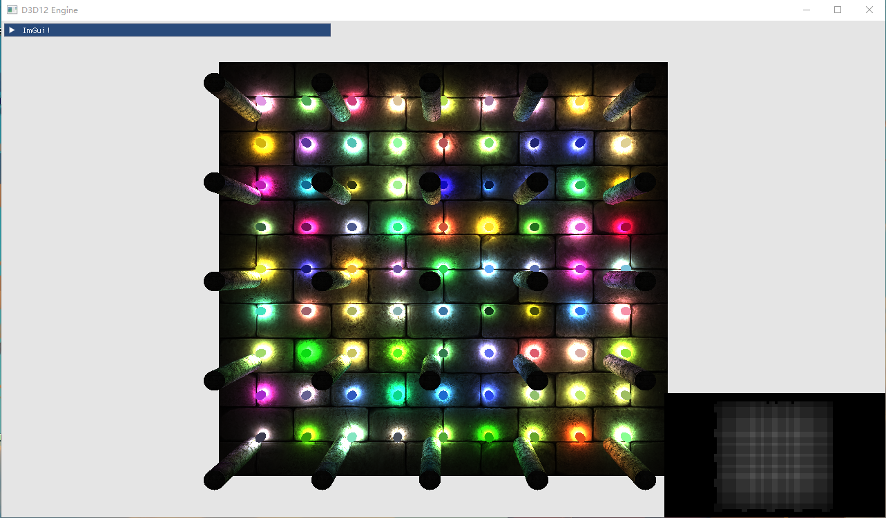
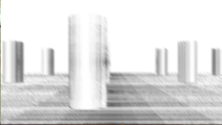
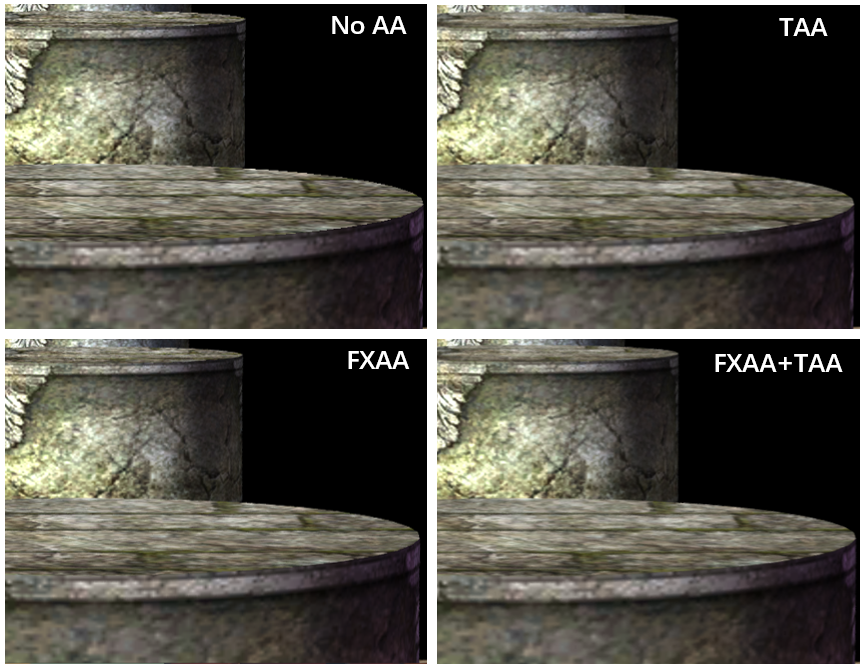
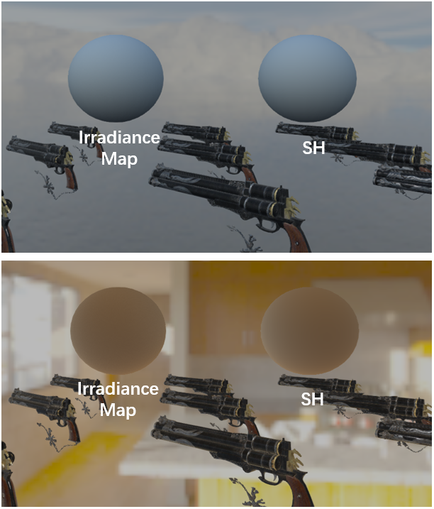

# Toy Renderer on DirectX 12

A toy  render written in C++ using DirectX 12.

## Basis

- D3D12 Memory  Management
  - Buddy Allocator
- D3D12 Descriptor Management
- Dear ImGUI
- Assimp

## Feature

- PBR and  IBL

- Shadows

- Cascaded Shadow Map

- Tile Based Deferred Rendering

- Forward Plus

- HBAO

- Temporal AA、FXAA

  

- SH

## TODO

- [x] PBR and  IBL
- [x] Shadows	
  - [x] PCF、PCSS、VSM、VSSM、ESM、EVSM
- [x] Cascaded Shadow Map
- [x] Tile Based Deferred Rendering
- [x] Forward Plus
- [x] SSAO\HBAO
- [x] Temporal AA
- [x] FXAA
- [x] Spherical harmonic
- [ ] SSR
- [ ] Bloom
